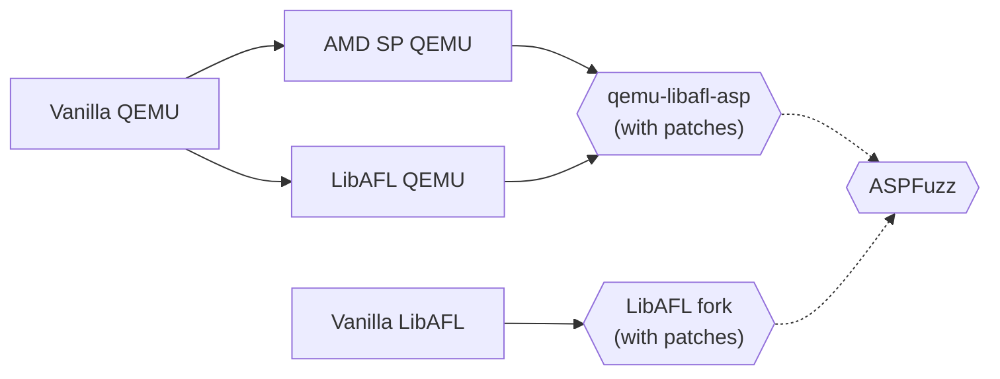
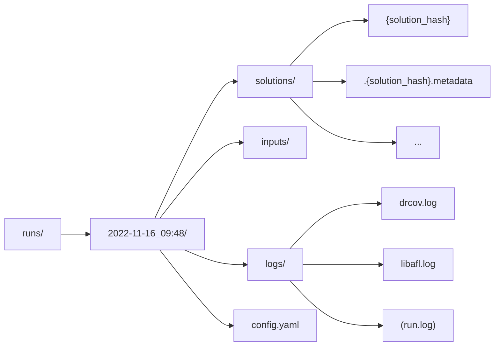

# ASPFuzz
Fuzzing the AMD Secure Processors ROM bootloader with LibAFL using QEMU full-system emulation 

## Project structure

## Requirements
- [Qemu requirements](https://wiki.qemu.org/Hosts/Linux) (Ubuntu: `sudo apt-get install git libglib2.0-dev libfdt-dev libpixman-1-dev zlib1g-dev ninja-build`)
- arm-none-eabi-gcc (Ubuntu `sudo apt install gcc-arm-none-eabi`)
- nettle (Ubuntu: `sudo apt install nettle-dev`)
- [rust](https://www.rust-lang.org/tools/install)
- [cargo](https://doc.rust-lang.org/cargo/getting-started/installation.html)
- [cargo-make](https://github.com/sagiegurari/cargo-make)

## Install
```
git submodule update --init
```

## Run
1. Navigate to `fuzzer/amd_sp/`.
```
cd fuzzer/amd_sp/
```
2. Pick a YAML file from `yaml/`
- Fuzz the on-chip bootloader for Ryzen Zen1: `yaml/ryzen_zen1_desktop_parse_asp_flash.yaml`
- Fuzz the on-chip bootloader for Ryzen Zen+: `yaml/ryzen_zen+_desktop_parse_asp_flash.yaml`
- Fuzz the on-chip bootloader for Ryzen Zen2: `yaml/ryzen_zen2_desktop_parse_asp_flash.yaml`
- Fuzz the on-chip bootloader for Ryzen Zen3: `yaml/ryzen_zen3_desktop_parse_asp_flash.yaml`
- Fuzz the on-chip bootloader for Ryzen ZenTesla: `yaml/ryzen_zentesla_parse_asp_flash.yaml`

3. Run the fuzzer
- `cargo make test -y {yaml_file_path}`
  - single-core
  - debug to `runs/{start_data_time}/logs/run.log`
- `cargo make run -y {yaml_file_path}`
  - single-core
  - no debug
- `cargo make run_fast -y {yaml_file_path}`
  - multi-core (all possible cores)
  - no debug
  - highly multithreaded

4. More configuration options\
`cargo make run -h`

5. Stop the fuzzer
- Single-core: `CTRL + a` -> `x`
- Multi-core: `sudo kill -9 $(pidof aspfuzz)`

6. Output


- Solutions can be found in `runs/{start_data_time}/solutions/`. Each solution file is named after the hashed test-case input. The `.{solution_hash}.metadata` contain useful metadata for debugging.
- The inputs used for the fuzzing campaign can be found under `runs/{start_data_time}/inputs/`.
- The LibAFL monitor log for the whole campaign is written to `runs/{start_data_time}/logs/libafl.log`.
- A DrCov trace file is generate for each campaign as `runs/{start_data_time}/logs/drcov.log`.
- If the campaign was started with `cargo make test`, all debug output will be captured in `runs/{start_data_time}/logs/run.log`.
- The yaml config file used for the campaign is stores as `runs/{start_data_time}/config.yaml`

7. Analyze the output
- Generate full flash ROM images from solutions: `script/solution2flashimg.py`
- Analyze flash images for the known buffer overflow in Zen1&Zen+: `script/known_buffer_overflow.py`.
- Evalute solution metadata file: `script/metadata_analyser.py`
- Plot libafl stats: `script/stats2plot.py`
- Visualize the DrCov coverage: Ghidra with the [Lightkeeper](https://github.com/WorksButNotTested/lightkeeper) plugin
